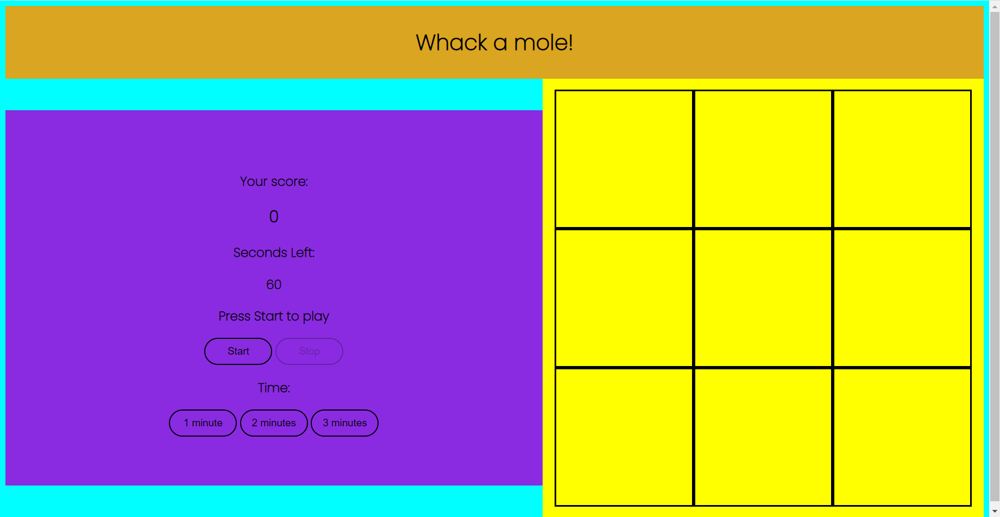
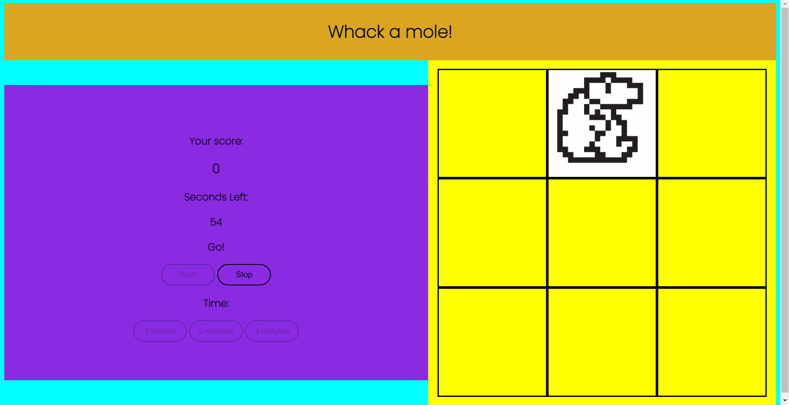

# Whack-A-Mole-Game

I have made a responsive Whack a mole game made using HTML, CSS and JavaScript. (Screenshots of webpage below)

The game has the following features:
1. You can set the amount of time one game should last
2. The mole changes its position randomly every one second

All the buttons, except for the stop button, are disabled when the game begins so that the game does not crash.

